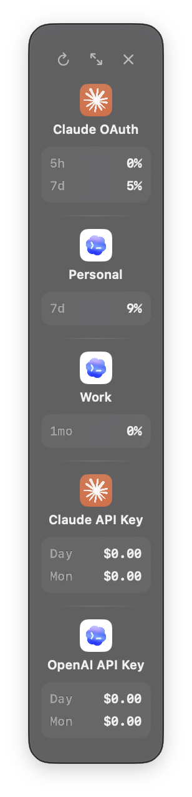

# CLIProxyManager

[한국어](README.md)

<table>
  <tr>
    <td></td>
    <td></td>
    <td></td>
  </tr>
</table>

CLIProxyManager is a macOS menu bar app for managing multiple Claude and Codex OAuth subscriptions, Claude and OpenAI API keys, and a local CLIProxyAPI server. Give each account its own command, configure model routing and round-robin selection, and monitor subscription usage and estimated API cost in one Usage HUD.

## Highlights

- Add and manage Claude/Codex OAuth accounts and multiple Claude/OpenAI API key profiles per provider in one place.
- Configure commands, nicknames, ordering, Usage HUD visibility, and authentication-specific settings per OAuth account or API key profile.
- Choose Direct or CLIProxyAPI connections for Claude OAuth and configure per-account Claude model mappings.
- Configure GPT model, reasoning, detected context window, and Fast mode per Opus, Sonnet, and Haiku role for Codex OAuth and OpenAI API keys.
- Create round-robin commands that rotate selected OAuth accounts between new CLI sessions while keeping one account fixed inside each session.
- Start, stop, inspect, and view logs for the local CLIProxyAPI server.
- Monitor OAuth subscription usage and API key tokens, requests, and estimated cost in the menu bar, expanded HUD, or compact HUD.
- Use the **cpm Command Line Tool** to manage the proxy, app, quota, and updates from Terminal or SSH.

## Requirements

- macOS 15 or later.
- [Claude Code](https://docs.anthropic.com/en/docs/claude-code) installed.
- A Claude/Codex OAuth account or a Claude/OpenAI API key.
- zsh if you want to use the generated terminal commands.

## Installation and macOS security warning

The release app is self-signed but is **not Apple-notarized**, so macOS may show a security warning the first time you launch it.

1. Download the latest DMG from [Releases](https://github.com/woosublee/CLIProxyManager/releases/latest) and install the app.
2. If macOS blocks the app, Control-click it in Finder and select **Open**, or go to **System Settings → Privacy & Security → Open Anyway**.

Only use release builds downloaded directly from GitHub Releases.

## Quick start

1. In the app, select **Add Provider** and add a Claude/Codex OAuth subscription or a Claude/OpenAI API key profile. You can add multiple API key profiles for the same provider.
2. In each account or API key profile's Settings, choose a nickname and command, such as `claude-work` or `codex-personal`.
3. Open a new Terminal window, or run:

   ```zsh
   source ~/.zshrc
   ```

4. Run the command you configured:

   ```zsh
   claude-work
   codex-personal
   ```

## Accounts and routing

- Reorder accounts from the main window with the drag handle or move commands. The same order is used in the menu bar and Usage HUD.
- Disable and re-enable OAuth accounts, blur account details, or exclude individual accounts from the Usage HUD.
- Claude OAuth can use a **Direct** or **CLIProxyAPI** connection. Direct follows Claude Code's current model policy, while CLIProxyAPI uses per-account model mappings.
- Each Claude or OpenAI API key profile has its own command, nickname, model routing, permission settings, and unique proxy prefix.
- Codex OAuth and each OpenAI API key profile can select a GPT model and reasoning effort for each Opus, Sonnet, and Haiku role. Supported models can enable Fast mode, and the detected context window is applied to Claude Code auto-compaction.
- Create provider-specific round-robin commands under **Settings → General → Routing**. Select at least two accounts to rotate the account used for each new CLI session; the chosen account stays fixed for that session.

## Local server network policy

CLIProxyAPI instances managed by CLIProxyManager bind only to `127.0.0.1`. Apps and terminals on the same Mac can use the proxy, but other devices on the same Wi-Fi, LAN, or VPN cannot connect directly. LAN and remote access are not currently supported.

The default port is `18317` in release builds and `18318` in development builds, and it can be changed under **Settings → Server**. For example, the default release endpoint is `http://127.0.0.1:18317`.

## Usage HUD

Use **Settings → Usage** to configure menu bar usage and the separate Usage HUD independently.

- Adjust window opacity and always-on-top behavior, and show or hide the HUD from the menu bar.
- Use the Usage HUD button on each account card to choose which accounts appear. The selection is shared by expanded and compact views and restored after relaunch.
- OAuth accounts show usage percentages and reset times for the `5h`, `7d`, or `1mo` periods reported by the provider API.
- Each Claude and OpenAI API key profile uses its unique routing prefix to aggregate local CLIProxyAPI usage records separately into Day/Mon token counts, request counts, and estimated cost. The cost is an estimate based on collected usage and the app's price catalog, not a provider invoice.
- Use the compact/expand control in the HUD header to switch between the 300pt-wide expanded view and the 108pt-wide compact view.
- Compact view shows each account's avatar, name, and period percentages or Day/Mon estimated cost in a vertical layout. Loading, unavailable, disabled, and stale states show `—` with a status indicator.
- The selected HUD mode and account list are restored after relaunch.

## Terminal and SSH

The **cpm Command Line Tool** controls CLIProxyManager from Terminal and SSH. Install it from **Settings → General → Command Line** with **Install cpm Command Line Tool**. The Update button appears only when the app includes a newer version.

```zsh
# Status and proxy control
cpm status [--json]
cpm start
cpm stop
cpm restart
cpm logs --lines 100
cpm logs -f

# App control
cpm app status
cpm app start
cpm app stop
cpm app restart

# OAuth subscription usage and the quota access key
cpm quota
cpm quota --json
cpm quota key status --json
printf '%s\n' "$MANAGEMENT_KEY" | cpm quota key set --stdin
cpm quota key delete

# App and CLIProxyAPI updates
cpm update check [app | proxy | all]
cpm update stage [app | proxy | all]
cpm update apply [app | proxy | all] [--yes]
```

## Updates

CLIProxyManager checks for new app versions while it is running and installs them through the Sparkle update prompt.

App updates and CLIProxyAPI binary updates are independent. At startup, the app compares the bundled CLIProxyAPI with the installed version and requests consent before applying an update that affects a running server.

From Terminal, choose `app`, `proxy`, or `all` as the update target.

```zsh
cpm update check all
cpm update stage all
cpm update apply all --yes
```

### Maintainer release procedure

The only manually edited source for the app version and build number is `release/version.json`. Do not edit the values in `Makefile` or `Info.plist` directly; `Info.plist` is a committed generated mirror.

```bash
# 1. Update version and build together in release/version.json, then sync the plist mirror
scripts/sync-release-version.sh
scripts/sync-release-version.sh --check

# 2. Inspect the resolved identity
scripts/resolve-release-version.sh json | plutil -p -

# 3. Run the GitHub Actions Self-signed Release workflow with the canonical tag
scripts/resolve-release-version.sh tag
```

The official release compares the source plist, GitHub tag, previous appcast build, app bundle, DMG filename, and generated appcast before it creates a tag or Release. It fails closed when identity is stale, the published build is not lower, or GitHub cannot be queried.

Use the local fallback only when CI release is unavailable and you have a separately verified previous appcast.

```bash
scripts/release-local.sh "$(scripts/resolve-release-version.sh tag)" \
  --previous-appcast /path/to/verified-previous-appcast.xml
```

The fallback artifact records `local-fallback` trust in `release-provenance.json`. Do not run CI release and local fallback concurrently. `ALLOW_LOCAL_RELEASE_CLOBBER=1` does not replace a completed release; it resumes a verified partial publish where the same commit was tagged but release or asset upload failed.

## Logs and diagnostics

The Log level under **Settings → Advanced** has two options: Info and Debug.

- **Info** records app launch, settings saves, CLIProxyAPI start/stop/restart, app and proxy update results, and failure summaries.
- **Debug** adds non-sensitive technical context and applies `debug: true` to the CLIProxyAPI YAML. API keys, OAuth tokens, management keys, email addresses, prompts, and raw request/response bodies are not logged at either level.
- The CLIProxyManager app log is stored at `~/.cliproxy-manager/logs/app.log` (`~/.cliproxy-manager/dev/logs/app.log` for development builds). The directory uses `0700`, the file uses `0600`, and the log rotates to `app.log.1` at 1 MiB.
- CLIProxyAPI proxy logs remain separate under `~/.cliproxy-manager/auth/logs/`, and `cpm logs` continues to show only these proxy logs.
- If the app log cannot be created or written safely, the app and proxy continue running and events fall back to macOS unified logging. If **App log** is unavailable in Advanced settings, fix symlinks or permissions in the managed logs path and restart the app.

## Troubleshooting

### My terminal command is not found

Open a new terminal window or run:

```zsh
source ~/.zshrc
```

Also make sure the command name in the account Settings is not empty.

### The local server is unavailable

Check the server status and the port under **Settings → Server**, then stop and start the server if necessary. CLIProxyAPI is local-only, so connect from the same Mac using `http://127.0.0.1:<configured port>`. Connections through another device's LAN IP or `0.0.0.0` are not supported. If the problem persists, inspect logs in **Advanced** settings.

### The app will not open

Follow the instructions in [Installation and macOS security warning](#installation-and-macos-security-warning) and select **Open** in Finder or **Open Anyway** in System Settings.

## Security

CLIProxyManager stores OAuth profiles and preferences under `~/.cliproxy-manager`. The current release stores the actual key for each API key profile in a separate plaintext file under `~/.cliproxy-manager/api-keys/` and does not provide a setting to switch API keys to macOS Keychain. Keys are not written to `config.json` or generated shell functions. The app applies `0700` permissions to the directory and `0600` permissions to each key and lock file, but anyone who can access your macOS account can read them. Do not copy, commit, or share this directory.

## License

CLIProxyManager is released under the [MIT License](LICENSE). It bundles or manages [CLIProxyAPI](https://github.com/router-for-me/CLIProxyAPI), which is also MIT-licensed.
