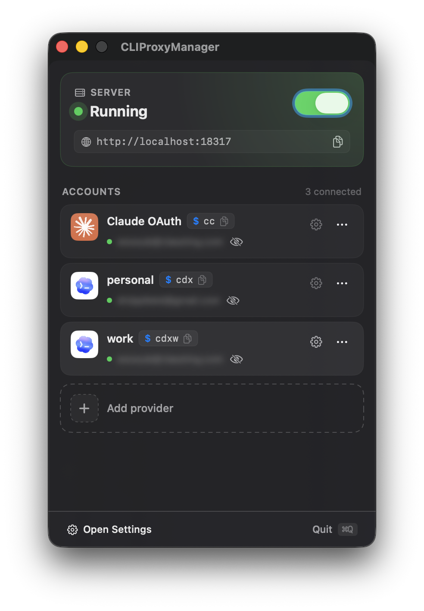
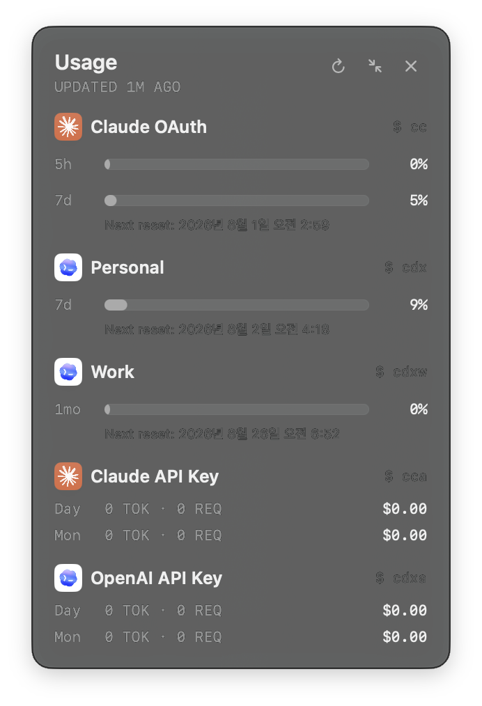

# CLIProxyManager

[한국어](README.md)

<table>
  <tr>
    <td></td>
    <td></td>
  </tr>
</table>

CLIProxyManager is a macOS menu bar app for managing multiple Claude and Codex OAuth accounts alongside a local CLIProxyAPI server. Give each account its own command and quickly choose which account runs Claude Code.

## Highlights

- Connect and manage multiple Claude OAuth and Codex OAuth accounts.
- Add Claude and OpenAI API keys with per-command nicknames, model mapping, and permission settings.
- Run every API key command through the local CLIProxyAPI path, isolated from OAuth subscription logins.
- Configure a command name, nickname, and model settings per account.
- Start, stop, inspect, and view logs for the local CLIProxyAPI server.
- Check subscription usage in the menu bar or a separate HUD window.
- Use the **cpm Command Line Tool** to manage the proxy, app, and usage from Terminal or SSH.

## Requirements

- macOS 15 or later.
- [Claude Code](https://docs.anthropic.com/en/docs/claude-code) installed.
- A Claude or Codex/OpenAI OAuth account.
- zsh if you want to use the generated terminal commands.

## Installation and macOS security warning

The release app is self-signed but is **not Apple-notarized**, so macOS may show a security warning the first time you launch it.

1. Download the latest DMG from [Releases](https://github.com/woosublee/CLIProxyManager/releases/latest) and install the app.
2. If macOS blocks the app, Control-click it in Finder and select **Open**, or go to **System Settings → Privacy & Security → Open Anyway**.

Only use release builds downloaded directly from GitHub Releases.

## Quick start

1. In the app, select **Add Provider** and add a Claude or Codex OAuth subscription or API key.
2. In each account's Settings, choose a command name, such as `claude-work` or `codex-personal`.
3. Open a new Terminal window, or run:

   ```zsh
   source ~/.zshrc
   ```

4. Run the command you configured:

   ```zsh
   claude-work
   codex-personal
   ```

## Usage HUD

Enable **Server Settings → Subscription Usage**, then use **General → Usage Overlay** to display a separate usage window.

- Adjust window opacity and always-on-top behavior.
- Show or hide the HUD from the menu bar.
- See per-account usage and reset times for Claude and Codex.
- Codex shows the actual period reported by the API: `5h` and `7d` for typical accounts, and `1mo` for Team plan monthly windows.
- Use the compact/expand control in the HUD header to switch between the 300pt full view and the 108pt compact view.
- Compact view keeps only the account avatar, name, and period usage percentages in a vertical layout, and the selected view is restored after relaunch.

## Terminal and SSH

The **cpm Command Line Tool** is the `cpm` command for controlling CLIProxyManager from Terminal and SSH. Install it from **Settings → General → Command Line** with **Install cpm Command Line Tool**. The Update button appears only when the app includes a newer version.

```zsh
# Status and proxy control
cpm status
cpm start
cpm stop
cpm restart
cpm logs -f

# App control
cpm app status
cpm app start
cpm app stop

# Per-account subscription usage
cpm quota
cpm quota --json
```

## Updates

CLIProxyManager checks for app updates while it is running. Follow the in-app prompt when an update is available.

You can also update from Terminal:

```zsh
cpm update check
cpm update stage
cpm update apply
```

CLIProxyAPI binary updates are independent from app updates. Check them from the app or with `cpm update check proxy`.

## Troubleshooting

### My terminal command is not found

Open a new terminal window or run:

```zsh
source ~/.zshrc
```

Also make sure the command name in the account Settings is not empty.

### The local server is unavailable

Check the server status in the app. Stop and start the server if necessary; if the problem persists, inspect logs in **Advanced** settings.

### The app will not open

Follow the instructions in [Installation and macOS security warning](#installation-and-macos-security-warning) and select **Open** in Finder or **Open Anyway** in System Settings.

## Security

CLIProxyManager stores OAuth profiles and preferences under `~/.cliproxy-manager`. API keys are stored as plaintext files under `~/.cliproxy-manager/api-keys/`. The app applies `0700` permissions to the directory and `0600` permissions to each key file, but anyone who can access your macOS account can read them. Do not copy, commit, or share this directory.

## License

CLIProxyManager is released under the [MIT License](LICENSE). It bundles or manages [CLIProxyAPI](https://github.com/router-for-me/CLIProxyAPI), which is also MIT-licensed.
