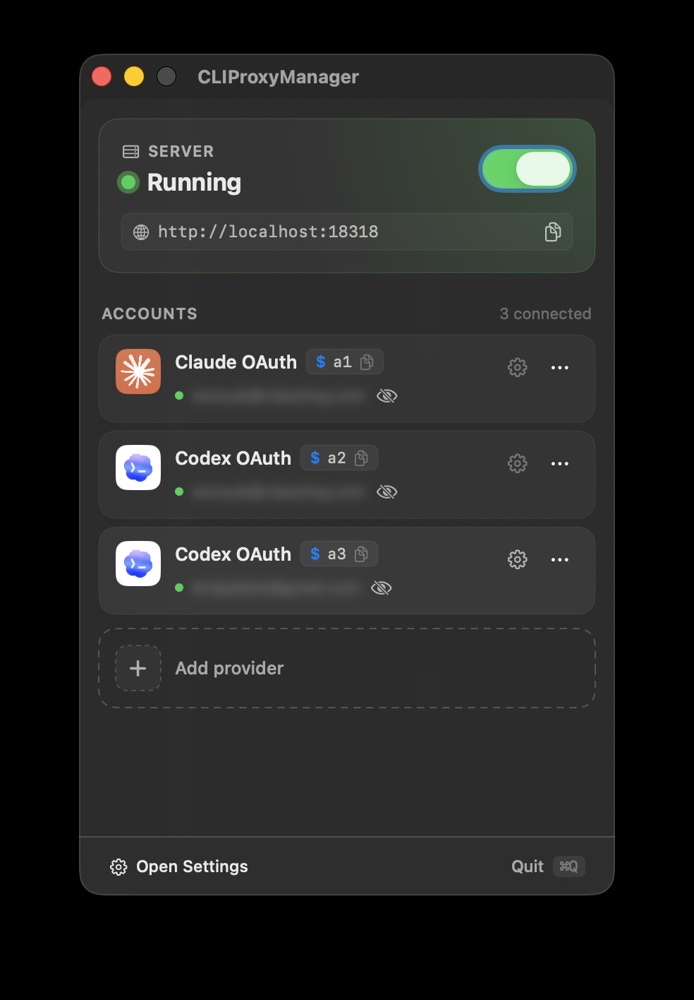
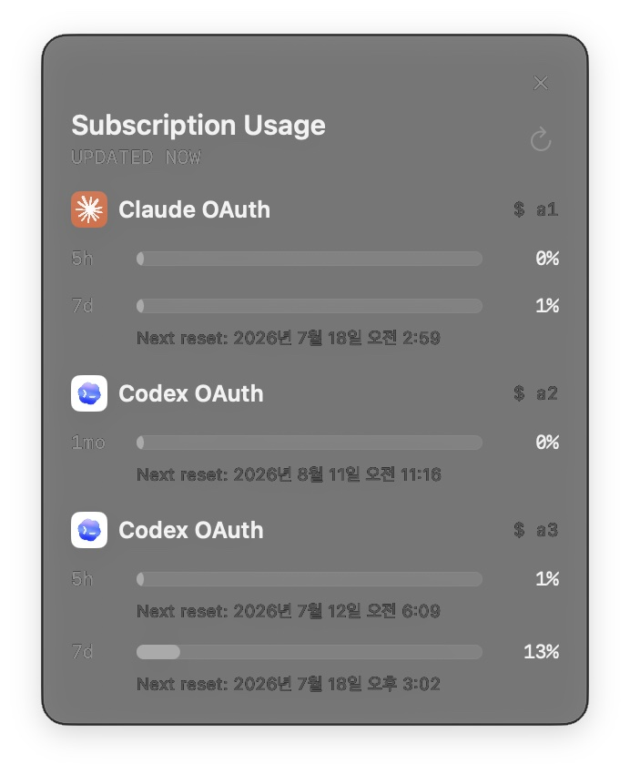

# CLIProxyManager

<table>
  <tr>
    <td></td>
    <td></td>
  </tr>
</table>

CLIProxyManager is a macOS menu bar app for managing a local CLIProxyAPI server, multiple OAuth accounts, and the shell functions you use to launch Claude Code through them.

It is designed for users who want one place to:

- Connect and manage multiple Claude OAuth and Codex OAuth accounts.
- Give each enabled account its own shell command name and optional nickname.
- Start, stop, and configure the bundled CLIProxyAPI server.
- Keep generated shell functions synchronized in `~/.zshrc`.
- Check account, server, usage, and shell setup status from the app.

## Requirements

- macOS 15 or later.
- Claude Code installed and available on your machine.
- A Claude or Codex/OpenAI account for OAuth sign-in; a Claude API key is optional for direct API-key routing.
- zsh if you want the app to manage shell functions automatically.

## Releases and automatic updates

Canonical automatic-update release artifacts are built in GitHub Actions, signed with the self-signed `cliproxymanager` code signing identity, and distributed as non-notarized DMGs on GitHub Releases. CLIProxyManager uses Sparkle 2 for automatic updates with this feed URL:

```text
https://github.com/woosublee/CLIProxyManager/releases/latest/download/appcast.xml
```

Each GitHub Release that should be available through automatic updates must include both:

- `CLIProxyManager-<version>.dmg`
- `appcast.xml`

Sparkle's EdDSA signature is separate from macOS code signing. The current automatic-update path intentionally stays on the existing self-signed, non-notarized signing model so releases can be cut from CI without interrupting the Sparkle update chain for existing installs. New users may still see macOS Gatekeeper or quarantine warnings because the DMG is non-notarized and not signed with an Apple Developer ID certificate.

The app currently keeps the hardened-runtime `disable-library-validation` entitlement enabled for this non-Developer-ID Sparkle distribution path. Release builds re-sign the bundled Sparkle framework and helper executables with the `cliproxymanager` identity, and without this entitlement macOS can reject the app at launch because the re-signed Sparkle code is not loaded under a matching Developer ID Team ID. Revisit this when Developer ID signing and notarization are introduced.

CLIProxyAPI binary updates are separate from CLIProxyManager app updates. On launch, CLIProxyManager checks the upstream `router-for-me/CLIProxyAPI` GitHub Releases feed in the background at most once every 24 hours. If a newer stable macOS arm64 CLIProxyAPI release is available, the app asks before downloading or applying it.

When the user accepts a CLIProxyAPI binary update, the app downloads `CLIProxyAPI_<version>_darwin_aarch64.tar.gz` and verifies it against upstream `checksums.txt` before storing it. The user can apply the verified binary immediately, which restarts the app-managed server if it is running, or defer it until the next server start. Checksum mismatches, missing assets, extraction failures, and version metadata mismatches keep the existing binary unchanged.

## Quick start

1. Open CLIProxyManager.
2. Use **Add Provider** to connect one or more accounts:
   - **Claude OAuth** for Claude subscription routing.
   - **Codex OAuth** for OpenAI/Codex-backed routing through the local proxy.
3. Give each account a unique command name and, optionally, a nickname.
4. Restart your terminal, or run:

   ```zsh
   source ~/.zshrc
   ```

5. Run the command name configured for the account you want to use:

   ```zsh
   claude-work
   codex-personal
   ```

The command names above are examples. CLIProxyManager generates the functions from the names you configure for enabled accounts.

## SSH and headless management

GUI 없이 SSH에서도 프록시와 앱을 완전히 제어할 수 있습니다. 동일한 비-root macOS 계정으로 SSH 접속하면 됩니다.

```
cpm --help   # 전체 명령어 목록
```

앱 설치 후 **Settings → General → Command Line**에서 **Install cpm**을 선택하세요. 앱은 `cpm` 설치·갱신·삭제를 선택했을 때만 macOS 관리자 인증을 요청합니다. 앱 업데이트로 CLI 명령이 추가되면 같은 화면에서 **Update cpm**을 선택하세요.

### 프록시 제어

```zsh
cpm status           # 프록시·앱·helper 상태 출력
cpm status --json    # JSON 형식으로 출력
cpm start            # CLIProxyAPI 프록시 시작
cpm stop             # 프록시 중지
cpm restart          # 프록시 재시작
cpm logs             # 최근 로그 200줄 출력
cpm logs --lines 50  # 최근 50줄 출력
cpm logs -f          # 실시간 로그 스트리밍
```

### 앱 lifecycle

```zsh
cpm app status   # GUI 앱 실행 여부 확인
cpm app start    # GUI 앱 실행
cpm app stop     # GUI 앱 종료
cpm app restart  # GUI 앱 재시작
```

The GUI app is optional — all proxy lifecycle operations work from an SSH session.

### Experimental subscription usage

CLIProxyManager can show Claude and Codex OAuth subscription usage in each account row of the menu bar. Enable **Subscription Usage (Experimental)** in Server Settings; the app creates the local CLIProxyAPI management key automatically in protected app-managed storage. Turning the setting off removes that local secret file and removes the proxy management configuration. The app never reads, displays, or exports OAuth tokens.

The management secret is stored as a `0600` JSON file at `~/.cliproxy-manager/subscription-usage-management-key.json`; debug builds use `~/.cliproxy-manager/dev/subscription-usage-management-key.json`. The app treats this file as the sole source of truth. Legacy subscription-usage Keychain records are intentionally neither read nor automatically removed, so normal app and CLI use cannot trigger a Keychain authentication prompt.

For headless automation, you may explicitly store and delete the local management key with `cpm quota key`; the GUI does not require manual key input.

For headless setup and display-only reporting:

```zsh
# Store the management key without echoing it back.
printf '%s' "$MANAGEMENT_KEY" | cpm quota key set --stdin
cpm quota key status
cpm quota
cpm quota --json
```

`cpm quota key status` reports only whether a key is configured, and `set --stdin` and `delete` never print the secret. `cpm quota key get` is intentionally unsupported. `cpm quota` reports normalized account/window states only; it does not modify routing, provider availability, credentials, or subscription limits. Usage refreshes every five minutes while the local proxy is ready; transient failures back off up to fifteen minutes.

### First `cpm` installation

Install a release containing `cpm` with the normal DMG flow, then open **Settings → General → Command Line** and choose **Install cpm**. Earlier releases only contain `cliproxy-manager`, so they cannot install `cpm` by themselves.

### 업데이트

```zsh
# 전체 (앱 + 프록시 바이너리) 업데이트
cpm update check          # 업데이트 가용 여부 확인
cpm update stage          # 다운로드 및 서명 검증
cpm update apply          # 적용 (TTY 확인 요청)
cpm update apply --yes    # 확인 생략 (자동화용)

# 개별 타겟
cpm update check proxy    # 프록시 바이너리만 확인
cpm update stage proxy
cpm update apply proxy

cpm update check app      # 앱 + helper만 확인
cpm update stage app
cpm update apply app
```

Key guarantees:
- `stage` verifies the appcast Ed25519 signature, artifact size, mounted app identity/version, code signature, and both helpers before changing any installed file.
- `apply` updates `/Applications/CLIProxyManager.app`, `/usr/local/bin/cpm`, and `/usr/local/bin/cliproxy-manager` together or restores the previous three paths if replacement fails.
- `cpm` must run as the same non-root macOS user that installed the app; `sudo cpm` is rejected and leaves the stage intact.
- GUI restart is best effort after successful app replacement; GUI absence does not prevent proxy or update management.
- `cpm update apply proxy` and app updates are independent; app update does not downgrade active CLIProxyAPI.
- Proxy binary update: `apply` preserves whether the proxy was running before the update.

## Shell functions

CLIProxyManager generates shell functions instead of aliases, so each command applies its account-specific routing only for that invocation.

Each enabled OAuth account has a unique command name that you choose in its settings. The generated function routes Claude Code through the bundled local CLIProxyAPI server using that account. Nicknames are for the app UI; command names are what you run in the terminal.

For example, if you configure `claude-work` for a Claude account and `codex-personal` for a Codex account:

```zsh
claude-work
codex-personal
```

You can connect multiple accounts of the same provider. Each account retains its own command name, routing prefix, and provider-specific settings. For Codex accounts, this includes the configured model, reasoning level, and context window.

The optional Claude API key flow also uses the command name you configure. Its function is generated only while a Claude API key is stored in macOS Keychain.

CLIProxyManager writes the generated functions to `~/.cliproxy-manager/functions.zsh` and maintains one managed source block in `~/.zshrc`.

## Settings overview

### General

Use General settings to control app appearance and behavior:

- Light, Dark, or System appearance.
- Launch at login.
- Menu bar only mode.

### Server

Use Server settings to control the local CLIProxyAPI runtime:

- Listen port.
- Bind address.
- Start server on launch.
- Manual restart after changing server settings.

The app writes the proxy config under:

```text
~/.cliproxy-manager/cliproxyapi/config.yaml
```

### Accounts

Connected provider rows appear after an auth profile exists. Each provider row lets you review the command name, nickname, connection details, and account actions.

Removing an account deletes the corresponding app-managed auth profile from:

```text
~/.cliproxy-manager/auth
```

### Advanced

Advanced settings include log level, log access, and reset actions. Resetting app settings preserves user-managed account data and command names, but resets preferences such as appearance, behavior, server settings, and logging level.

## Files managed by the app

CLIProxyManager stores app-managed files under:

```text
~/.cliproxy-manager
```

Important files and directories:

| Path | Purpose |
| --- | --- |
| `~/.cliproxy-manager/config.json` | App preferences and command settings. |
| `~/.cliproxy-manager/subscription-usage-management-key.json` | Owner-only (`0600`) local management secret when subscription usage is enabled. |
| `~/.cliproxy-manager/functions.zsh` | Generated shell functions. |
| `~/.cliproxy-manager/auth/` | App-managed OAuth profile files. |
| `~/.cliproxy-manager/logs/` | App and proxy logs. |
| `~/.cliproxy-manager/cliproxyapi/` | Bundled proxy binary and generated proxy config. |

When shell functions are installed, CLIProxyManager adds or updates one managed block in `~/.zshrc` that sources `~/.cliproxy-manager/functions.zsh`.

## Troubleshooting

### The command is not found in my terminal

Restart your terminal or run:

```zsh
source ~/.zshrc
```

Then check that the shell functions file exists:

```zsh
ls ~/.cliproxy-manager/functions.zsh
```

### The app reports a shell function name conflict

Another function or alias with the same name already exists in your shell profile. Choose a different command name in CLIProxyManager, or remove the conflicting function from your shell profile.

### The optional Claude API key command is missing

The direct Claude API key function is generated only while a Claude API key is stored in macOS Keychain and its configured command name is not blank. Add or update the key and command name in the app, then restart your terminal or run `source ~/.zshrc`.

### The local server is not responding

Open CLIProxyManager and check the server status. If needed:

1. Stop the server.
2. Start it again.
3. Confirm the configured port is not already used by another process.
4. Open logs from the Advanced settings screen.

### Codex models are not listed

Start the local server and confirm the Codex OAuth profile is connected. If model loading still fails, enter the model names manually in Codex settings.

## Security and credentials

- The subscription-usage management secret is stored only in the owner-only (`0600`) app-managed local file described above; legacy subscription Keychain records are ignored.
- OAuth profile files are stored under `~/.cliproxy-manager/auth`.
- Generated shell functions use a local dummy API key only for the app-managed local proxy.
- Do not commit files from `~/.cliproxy-manager` to a repository.

## CLIProxyAPI license notice

This app bundles or manages CLIProxyAPI, which is distributed under the MIT License. The CLIProxyAPI license text is included at:

```text
Sources/CLIProxyManagerApp/Resources/Licenses/CLIProxyAPI-LICENSE.txt
```

When distributing this app with CLIProxyAPI, keep the upstream CLIProxyAPI copyright notice and MIT permission notice in the app bundle and public release materials.

## Updating the bundled CLIProxyAPI binary

CLIProxyManager vendors the official macOS arm64 CLIProxyAPI release binary into:

```text
Sources/CLIProxyManagerApp/Resources/cliproxyapi/cliproxyapi
```

This vendoring flow changes the default binary shipped inside the app. It is still useful for release baselines, but day-to-day CLIProxyAPI updates can also be applied by the installed app through the in-app CLIProxyAPI binary updater.

Use the vendoring script with an upstream release version:

```zsh
scripts/vendor-cliproxyapi.sh 7.0.0
```

The script downloads `router-for-me/CLIProxyAPI` release assets from GitHub, verifies the archive against upstream `checksums.txt`, copies the archive's `cli-proxy-api` executable as `cliproxyapi`, and writes:

```text
Sources/CLIProxyManagerApp/Resources/cliproxyapi/cliproxyapi.manifest.json
```

After updating the binary, verify it is bundled by running:

```zsh
swift test --filter LicenseResourceTests/testCLIProxyAPIBinaryResourceIsBundled
```

Commit the updated binary and manifest together.

## Cutting an automatic-update release

Automatic-update releases require two signing materials in GitHub Secrets:

- `CLIPROXYMANAGER_CERTIFICATE_BASE64`: base64-encoded `.p12` export of the self-signed `cliproxymanager` code signing certificate, including its private key.
- `CLIPROXYMANAGER_CERTIFICATE_PASSWORD`: password for that `.p12` export.
- `SPARKLE_PRIVATE_KEY`: Sparkle EdDSA private key for signing `appcast.xml`.

The committed Sparkle public key lives in `Info.plist` as `SUPublicEDKey`. The private key and `.p12` certificate export must not be committed.

To create or export the Sparkle key pair, download the Sparkle 2.9.2 tarball and run `generate_keys`:

```zsh
mkdir -p build
curl -L -o build/Sparkle-2.9.2.tar.xz https://github.com/sparkle-project/Sparkle/releases/download/2.9.2/Sparkle-2.9.2.tar.xz
tar -xf build/Sparkle-2.9.2.tar.xz -C build
build/Sparkle-2.9.2/bin/generate_keys -x build/sparkle_private_key.txt
```

If `generate_keys -x` creates a Keychain item whose account is the export file path, copy the same private key value into the canonical item instead of generating a new key:

```zsh
security add-generic-password \
  -U \
  -s "https://sparkle-project.org" \
  -a "com.woosublee.CLIProxyManager.sparkle.ed25519" \
  -l "Private key for signing Sparkle updates" \
  -D "private key" \
  -j "Public key (SUPublicEDKey value) for this key is:\n\n$(plutil -extract SUPublicEDKey raw Info.plist)" \
  -w "$(cat build/sparkle_private_key.txt)"
```

Local fallback tooling reads that canonical Keychain item automatically when `SPARKLE_PRIVATE_KEY` is unset. Do not commit `build/sparkle_private_key.txt`.

Before running the release workflow, update the version and build number in both `Info.plist` and `Makefile`. The workflow rejects releases when `make -s print-app-version`, `make -s print-build-number`, `make -s print-build-tag`, and the workflow input tag disagree.

Run the **Self-signed Release** GitHub Actions workflow with a new tag such as `v1.2.3`. Do not create the tag first; the workflow checks that the remote tag does not already exist, builds from the workflow commit, signs the app and DMG with the imported `cliproxymanager` certificate, generates `build/appcast.xml`, creates the tag, and uploads both release assets:

- `CLIProxyManager-<version>.dmg`
- `appcast.xml`

This CI release is self-signed and non-notarized. It keeps the existing Sparkle update path compatible with local self-signed releases, but it does not remove first-launch Gatekeeper warnings for brand-new installs. A Developer ID signed and notarized release path can be introduced later.

### Local fallback release

Local fallback releases still require a code signing identity named `cliproxymanager` in the local Keychain. Confirm it before cutting a fallback release:

```zsh
security find-identity -v -p codesigning | grep '"cliproxymanager"'
```

The fallback script does not create code signing certificates automatically. It validates the `v*` tag, requires the local `cliproxymanager` code signing identity, reads `CFBundleVersion` from `Info.plist`, builds and verifies the signed DMG, generates `build/appcast.xml` using the Keychain Sparkle private key, and uploads both release assets with the authenticated `gh` CLI:

```zsh
scripts/release-local.sh v1.2.3
```

By default, the fallback script does not clobber existing GitHub Release assets. Set `ALLOW_LOCAL_RELEASE_CLOBBER=1` only when you intentionally want to replace the DMG and appcast for an existing release.

Sparkle updates the app bundle, but it does not automatically overwrite the `/usr/local/bin/cliproxy-manager` helper. If a release changes the helper, reinstall it from CLIProxyManager after updating.

## Provider terms

CLIProxyManager is not an official product of Anthropic, OpenAI, Codex, or any other model provider. It should not be described as endorsed, certified, or guaranteed by those providers.

Users are responsible for using their own accounts and credentials in compliance with each provider's terms, usage policies, and account requirements.
